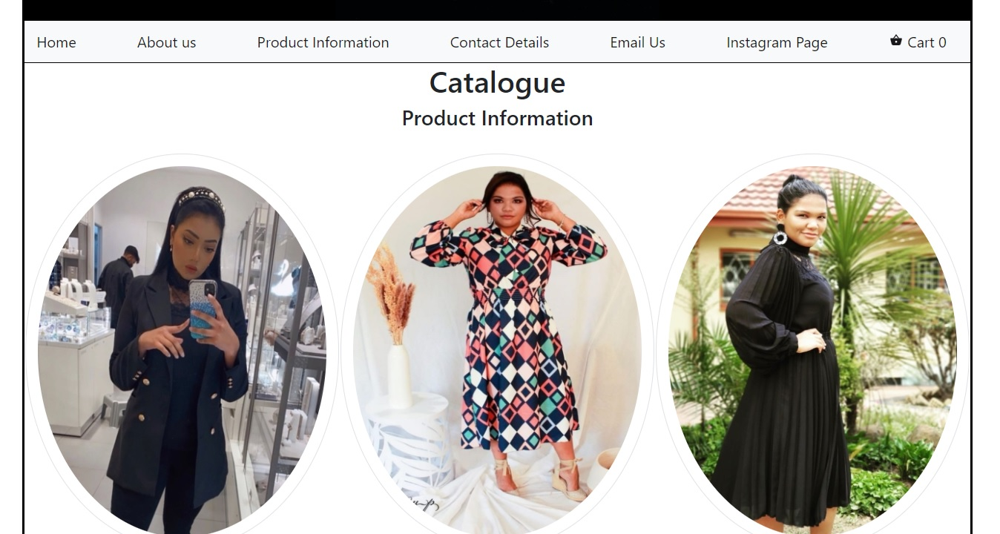
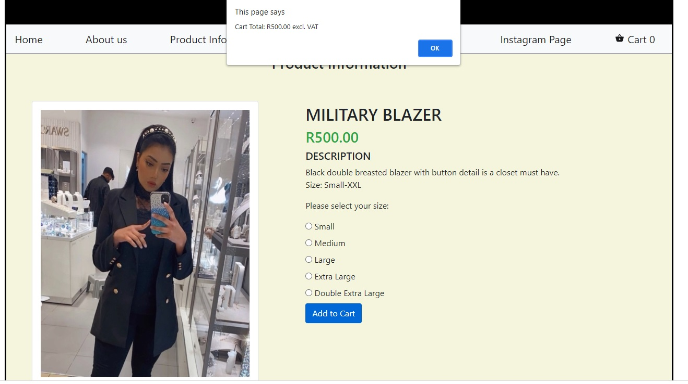
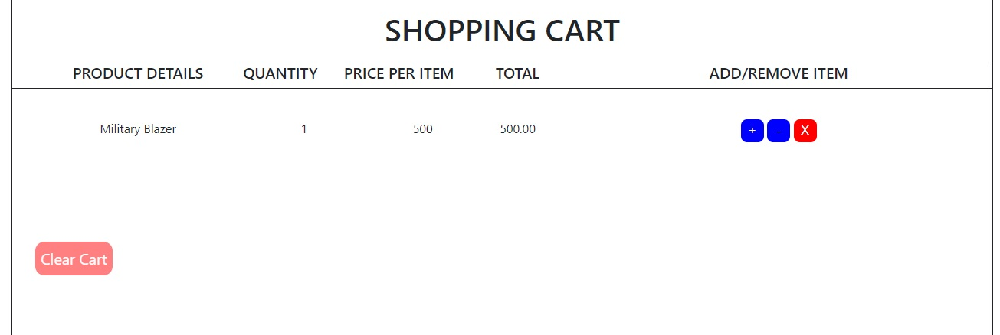
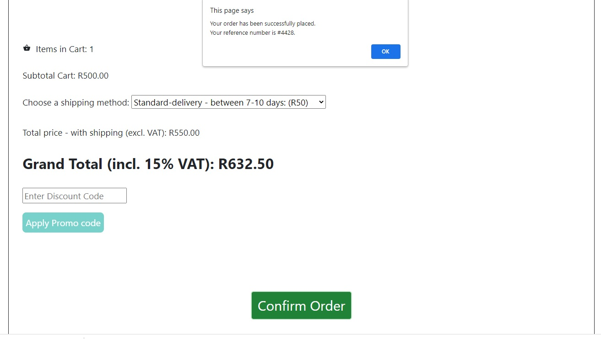

# OnlineStoreOSA
HyperionDev Online Store Capstone Project
<!-- This is an example of a Blockquote -->
> An online clothing store created with HTML, CSS and JavaScript. 

## Table of Contents
* [General Info](#general-information)
* [Installation](#installation)
* [Usage](#usage)
* [Screenshots](#screenshots)
* [Credits](#credits)
* [Contact](#contact)

## General Information
- This project was undertaken in order to demonstrate the skills that I acquired from the Full Stack Web Development bootcamp offered by **Hyperion Development.** 
- This is a real-world application of an online clothing store that was created using HTML, CSS and JavaScript.

## Installation
- In order to install this project locally, you would need to use the git clone [repository_url] command.

- Please follow the steps below in order to clone this remote repository:
  
1. On GitHub, navigate to the main page of the repository. Click on the green button - **"Code"**

<!-- Square brackets contain Alt text if image does not load -->

2. Copy the URL displayed.
3. Open up the command prompt by typing _cmd_ in the search bar - on Windows.
4. Select the directory in which you would like to store the cloned respository.
5. Thereafter, enter git clone, and then paste the URL that you copied earlier. e.g. git clone https://github.com/RiazK09/OnlineStoreOSA.git
6. Hit enter to create a local clone on your device.
7. If you go to this new directory, you will find all the project files, ready to be utilised.

## Usage
The cloned repository will contain all the project files. This new directory will have the following folders:
- CSS (This folder contains a single stylesheet used for styling all the webpages).
- HTML (This folder contains all the HTML web pages for navigation purposes - This directory has a sub-folder called *products* which contains seperate web pages for each product listed on the online store).
- JS (A JavaScript file which is linked to all HTML files in order to add **functionality** to the website).
- Images (This folder contains all the images utilised on the website).

## Screenshots
<!-- My screenshots will be added here -->
- Catalogue Page displaying the products for sale.

- Each product page has an option to "add-to-cart".

- Users can see what is in their cart, along with each item's quantity and price.

- Users can confirm their orders once they have selected their preferred delivery option.They also have an option to enter a discount code which will reduce the total amount due.

## Credits
- The shopping cart for this online store was based on [this tutorial](https://www.youtube.com/playlist?list=PLoN_ejT35AEhzNoPStBzAkpqAu3YQwPj7) - by Mitchell Hudson.
- Many thanks to my mentor, Mr Seraaj De Villiers for all the motivation, belief and unwavering support.

## Contact
Created by [@RiazK09](https://www.linkedin.com/in/riaz-karolia/) - Feel free to contact me!
<!-- If you click on my username, it will take you to my LinkedIn profile -->
